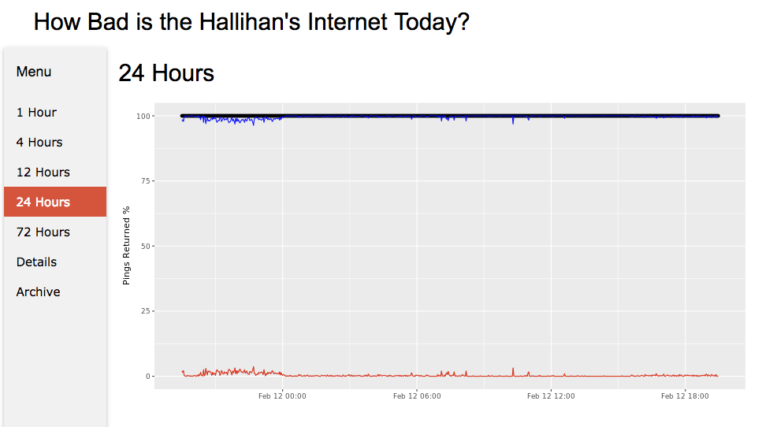

# PingGraph

This is a simple, rough, not-well-thought-out tracker I made to keep track of the quality of my home Internet connection after a sequence of repeated poor connectivity periods.  It is not meant for prime time, production use, or as a basis to ridicule my shell scrips or rudimentary R scripts.  No warranties express, implied, or inferred.

## Dependencies:
* Ability to understand Cron, or to type "cron -e" and figure it out from there.
* Something to publish a basic HTML Web Page (I just run under apache).
* R - I installed r-base and r-tools, then installed the ggplot2 package (local to the user that would run the cron jobs).

## Parts:
* settings.sh - Set the config params (this is sourced in each of the other scripts)

* collect.sh - Run this every 2 minutes to collect data to the CSV file
  * format.sh - creates the index.html file that is almost the same, with the raw data inserted for the details tab (ToDo: index.html should be a static file)
  * graphs.r - create the up-to-date graphics
* daily.sh - run once daily after midnight - create a daily csv, clean anything older than 3 days out of the working csv
  * daily.r - create a 24-hour graph for the archive

##### The best way to provide feedback is a pull request that actually fixes something.  Thanks!